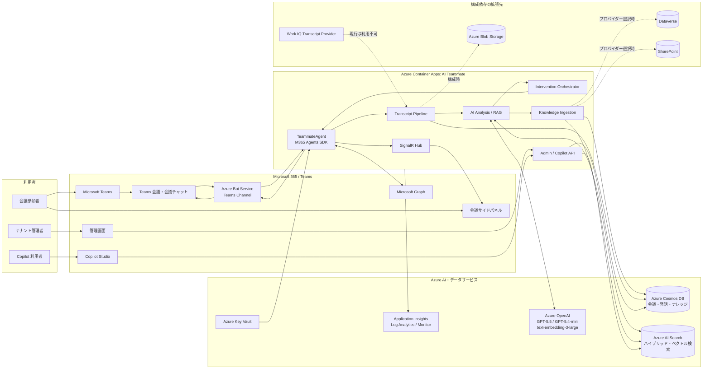
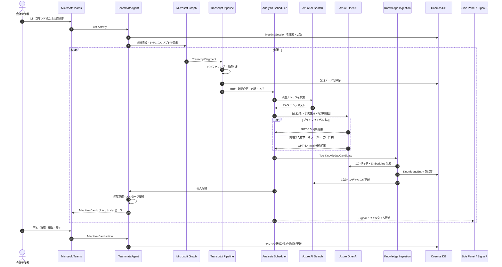
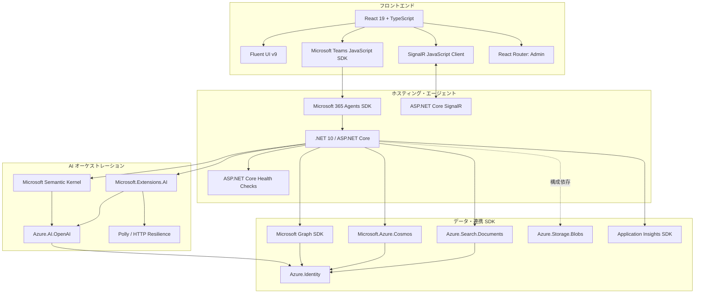
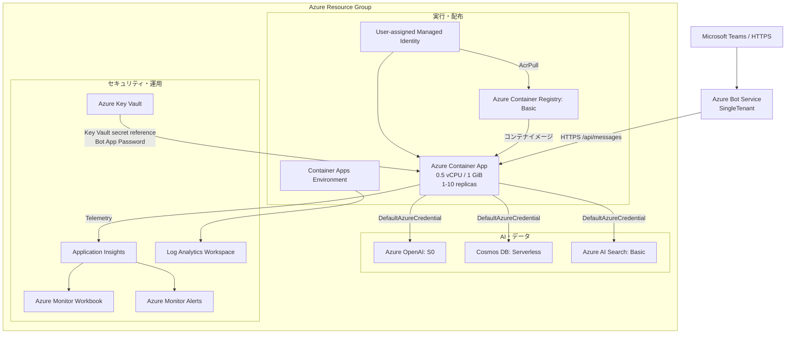
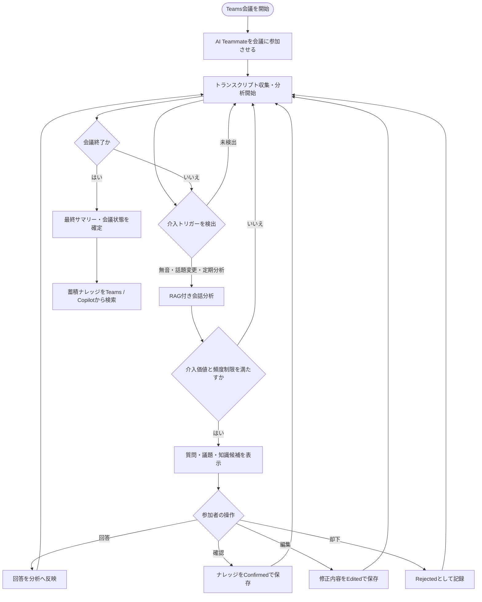

# AI Teammate エージェント アーキテクチャ

## 1. この資料の目的

本資料は、AI Teammate の現行実装を基準に、以下の観点を図示したものです。

- Teams 会議からナレッジ蓄積までのデータフロー
- バックエンド、フロントエンド、AI 処理で利用するフレームワークと SDK
- Azure 上の配置、サービス間接続、認証方式
- 会議参加者、管理者、Copilot 利用者のユーザーフロー

図中の「拡張」は、コード上に抽象化や実装が存在するものの、現行 Bicep だけでは有効化されない構成依存の経路です。

## 2. 論理アーキテクチャ

## 3. 会議データフロー

### 主要データと保存先

| データ | 生成元 | 主な処理 | 現行の保存先 |
| --- | --- | --- | --- |
| MeetingSession | `join`、会議イベント | 状態・参加者・開始終了管理 | Cosmos DB `sessions` |
| TranscriptSegment | Microsoft Graph | バッファリング、言語判定、会話ウィンドウ化 | Cosmos DB `transcripts` |
| AnalysisResult | Azure OpenAI | 話題、質問、サマリー、暗黙知候補の生成 | 会議処理内で利用、関連データを永続化 |
| KnowledgeEntry | Knowledge Ingestion | 重複判定、エンリッチ、Embedding、承認状態管理 | Cosmos DB `knowledge`、Azure AI Search |
| AgentSettings / AuditLog | 管理 API、カード操作 | テナント単位の設定・操作記録 | Cosmos DB 用リポジトリ |
| Telemetry | Agent、API、各サービス | トレース、メトリック、正常性監視 | Application Insights / Log Analytics |

## 4. フレームワーク・SDK構成

| レイヤー | フレームワーク / SDK | 用途 |
| --- | --- | --- |
| Agent | Microsoft 365 Agents SDK | Teams Activity、コマンド、Adaptive Card action、Botライフサイクル |
| Web | .NET 10 / ASP.NET Core | Agentホスト、REST API、DI、Health Check、SignalR |
| AI | Semantic Kernel | 埋め込みプロンプトとAzure OpenAI連携 |
| AI抽象化 | Microsoft.Extensions.AI | `IChatClient`、プライマリ・フォールバックモデルの共通化 |
| 耐障害性 | Polly / Microsoft.Extensions.Http.Resilience | リトライ、サーキットブレーカー、フォールバック制御 |
| M365連携 | Microsoft Graph SDK | 会議情報、トランスクリプト、チャット、SharePoint拡張 |
| 検索 | Azure.Search.Documents | キーワード・セマンティック・ベクトルのハイブリッド検索 |
| 永続化 | Microsoft.Azure.Cosmos | 会議、発話、ナレッジ、設定、監査データへのアクセス |
| 認証 | Azure.Identity | `DefaultAzureCredential` とユーザー割り当てマネージドID |
| UI | React 19 / Fluent UI v9 | 会議サイドパネルと管理画面 |
| Teams UI連携 | Teams JavaScript SDK | Teamsコンテキスト取得、アプリ初期化 |
| リアルタイムUI | SignalR | 分析結果と会議状態のプッシュ通知 |

## 5. Azure 配置・認証アーキテクチャ

### Azure サービス一覧

| Azure サービス | 役割 | 現行構成 |
| --- | --- | --- |
| Azure Container Apps | Agent、API、SignalR、Health Checkの実行 | 外部HTTPS ingress、HTTPスケール、最小1・最大10レプリカ |
| Azure Container Registry | Agentコンテナイメージの保管 | Basic、管理者アカウント無効、Managed IdentityでPull |
| Azure Bot Service | Teams ChannelとAgent endpointの中継 | SingleTenant、`/api/messages`へ配送 |
| Microsoft Entra ID | BotアプリID、テナント境界 | `AzureADMyOrg`、Agent設定もSingleTenant |
| User-assigned Managed Identity | Azure SDKの資格情報 | `AZURE_CLIENT_ID` と `DefaultAzureCredential` で利用 |
| Azure Key Vault | Botクライアントシークレット | Container AppsのKey Vault参照として注入 |
| Azure OpenAI | 会話分析、質問・サマリー生成、Embedding | GPT-5.5、GPT-5.4-mini、text-embedding-3-large |
| Azure Cosmos DB | トランザクションデータの主保存先 | Serverless、Session consistency |
| Azure AI Search | RAG検索とナレッジ索引 | Basic、Semantic Search有効 |
| Application Insights | アプリケーションテレメトリ | ASP.NET Core SDKから送信 |
| Log Analytics | Container Appsログ | 30日保持 |
| Azure Monitor | Workbookとアラート | Application Insightsを監視対象として利用 |

## 6. ユーザーフロー

### 利用者別の入口と成果

| 利用者 | 主な入口 | 主な操作 | 得られる成果 |
| --- | --- | --- | --- |
| 会議参加者 | Teams会議チャット、Adaptive Card、サイドパネル | `join`、`status`、`summarize`、`knowledge`、回答・確認・編集・却下 | 会議中の補助質問、リアルタイム分析、会議サマリー、再利用可能なナレッジ |
| テナント管理者 | Admin UI / `/api/admin` | ダッシュボード確認、介入設定、ナレッジ・ユーザー管理 | 利用状況、品質、設定、監査証跡の管理 |
| Copilot利用者 | Copilot Studio / `/api/copilot` | テナント内ナレッジ検索、詳細取得、統計参照 | RAGによる組織ナレッジの再利用 |

## 7. 実装境界と拡張ポイント

| 項目 | 現在の位置づけ | 図上の扱い |
| --- | --- | --- |
| GraphTranscriptProvider | 現行の利用可能なトランスクリプト経路 | 主経路 |
| WorkIQTranscriptProvider | `IsAvailableAsync` が利用不可を返すスタブ | 拡張経路 |
| CosmosKnowledgeStore | 既定のナレッジ保存先 | 主経路 |
| AzureAISearchKnowledgeStore / Retriever | RAG索引・検索用 | 主経路。ただし索引初期化とRBACが必要 |
| DataverseKnowledgeStore | 環境URL設定時に利用する代替プロバイダー | 拡張経路 |
| SharePointKnowledgeStore | Site ID設定時に利用する代替プロバイダー | 拡張経路 |
| Azure Blob Storage | SDKと永続化サービスは存在するが、現行BicepにStorage Accountはない | 拡張経路 |
| Side Panel / Admin UI | Reactアプリは存在するが、現行Container App Bicepに静的配信の明示構成はない | UI論理構成として表示 |
| Cosmos settings / audit-logs | リポジトリ実装は存在するが、現行Cosmos Bicepの明示コンテナは3個 | 配備時に追加初期化が必要 |

## 8. 実装参照

- Agent起動・DI: [Program.cs](../../TeamsAITeammate/src/TeamsAITeammate.Agent/Program.cs)
- Bot処理: [TeammateAgent.cs](../../TeamsAITeammate/src/TeamsAITeammate.Agent/TeammateAgent.cs)
- トランスクリプト処理: [TranscriptPipelineOrchestrator.cs](../../TeamsAITeammate/src/TeamsAITeammate.Infrastructure/Services/TranscriptPipelineOrchestrator.cs)
- AI分析: [ConversationAnalyzer.cs](../../TeamsAITeammate/src/TeamsAITeammate.AI/Services/ConversationAnalyzer.cs)
- RAG分析: [RagEnhancedConversationAnalyzer.cs](../../TeamsAITeammate/src/TeamsAITeammate.AI/Services/RagEnhancedConversationAnalyzer.cs)
- ナレッジ取り込み: [KnowledgeIngestionPipeline.cs](../../TeamsAITeammate/src/TeamsAITeammate.AI/Services/KnowledgeIngestionPipeline.cs)
- 介入制御: [InterventionOrchestrator.cs](../../TeamsAITeammate/src/TeamsAITeammate.Infrastructure/Services/InterventionOrchestrator.cs)
- RAG検索: [AzureAISearchRetriever.cs](../../TeamsAITeammate/src/TeamsAITeammate.Infrastructure/Services/AzureAISearchRetriever.cs)
- Azure構成: [main.bicep](../../TeamsAITeammate/infra/main.bicep)
- Teamsアプリ定義: [manifest.json](../../TeamsAITeammate/appPackage/manifest.json)
