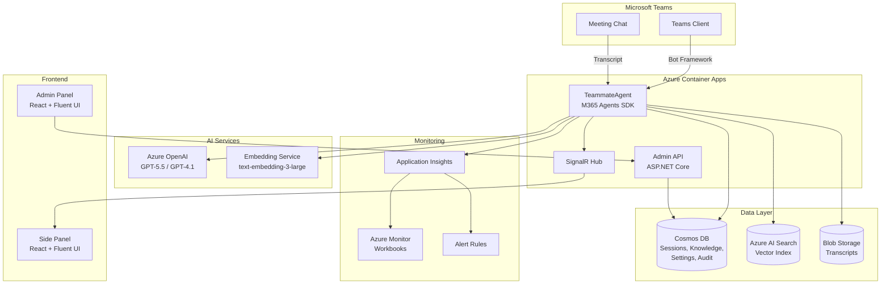
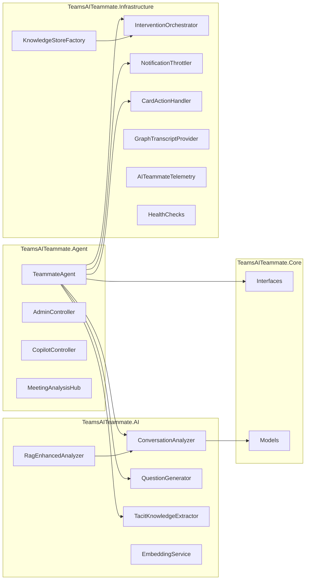
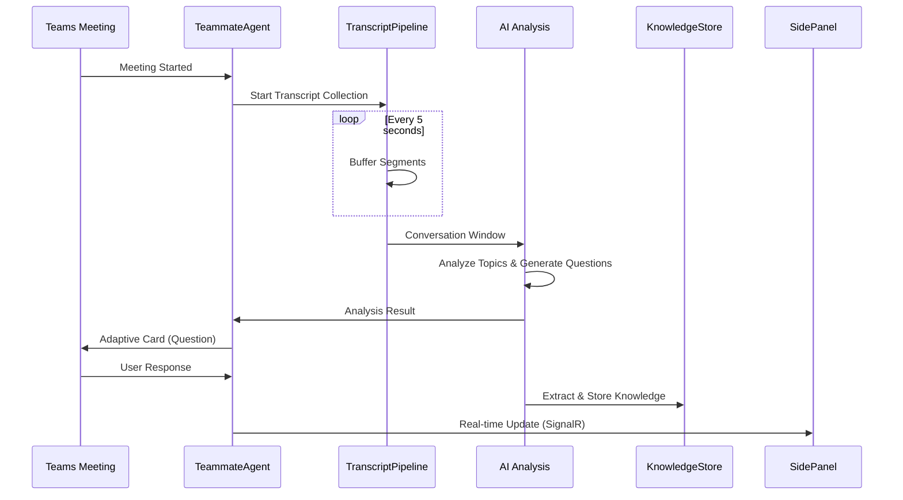

# AI Teammate アーキテクチャ概要

## システムアーキテクチャ

## コンポーネント構成

## データフロー

## テクノロジースタック

| レイヤー | 技術 |
| --------- | ------ |
| Runtime | .NET 10 / ASP.NET Core |
| Bot Framework | Microsoft 365 Agents SDK |
| AI | Azure OpenAI (GPT-5.5, GPT-4.1) |
| Vector Search | Azure AI Search + text-embedding-3-large |
| Database | Azure Cosmos DB |
| Frontend | React 19 + Fluent UI v9 + TypeScript |
| Hosting | Azure Container Apps |
| CI/CD | GitHub Actions |
| Monitoring | Application Insights + Azure Monitor |
| IaC | Bicep |
