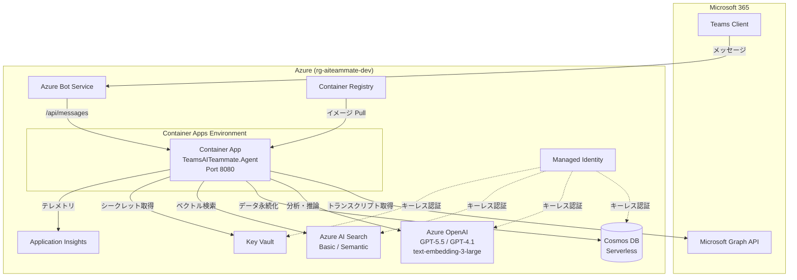

# Teams AI Teammate - 本番環境セットアップ手順書

## 概要

本ドキュメントは、Teams AI Teammate（フェーズ1〜8 実装済み）を Azure 環境にデプロイし、本番想定で動作確認するための**一気通貫の手順書**です。

---

## 前提条件

### ツール

| ツール | バージョン | インストール |
| ------ | ---------- | ------------ |
| Azure CLI (`az`) | 2.70+ | `brew install azure-cli` |
| Azure Developer CLI (`azd`) | 1.12+ | `brew install azd` |
| .NET SDK | 10.0+ | <https://dot.net/download> |
| Node.js | 22+ | <https://nodejs.org/> |
| Docker Desktop | 27+ | <https://www.docker.com/products/docker-desktop/> |
| Teams Toolkit (VS Code 拡張) | 最新 | VS Code Extensions で検索 |

### Azure サブスクリプション要件

- **Azure OpenAI** へのアクセスが有効（リージョン: `eastus2` or `swedencentral` 推奨）
- **Azure AI Search** Basic SKU 以上のクォータ
- **Azure Cosmos DB** Serverless のクォータ
- **Azure Container Apps** のクォータ（最低 vCPU: 2）
- サブスクリプション Owner または Contributor + User Access Administrator ロール

### Microsoft 365 テナント要件

- Microsoft 365 Business Premium 以上（Teams が利用可能）
- Teams 管理センターでの**カスタムアプリのサイドロード**が許可されていること
- テナント管理者（Global Admin）による API 同意の付与が可能であること

---

## 手順一覧

| ステップ | 作業内容 | 所要時間 (目安) |
| -------- | -------- | --------------- |
| 1 | Azure CLI ログイン & サブスクリプション設定 | 2分 |
| 2 | リソースグループ作成 | 1分 |
| 3 | Entra ID アプリ登録（Bot用） | 5分 |
| 4 | Admin Consent 付与 | 3分 |
| 5 | Azure Developer CLI 初期化 | 2分 |
| 6 | インフラストラクチャ プロビジョニング（Bicep） | 10〜15分 |
| 7 | アプリケーション ビルド & デプロイ | 5〜10分 |
| 8 | Teams Bot チャネル登録 | 5分 |
| 9 | Teams アプリパッケージ作成 & サイドロード | 5分 |
| 10 | 動作確認 & ヘルスチェック | 5分 |
| 11 | (オプション) Agent 365 登録 | 10分 |

**合計: 約 50〜60分**

---

## Step 1: Azure CLI ログイン & サブスクリプション設定

```bash
# Azure にログイン
az login

# Azure Developer CLI にログイン
azd auth login

# サブスクリプション一覧を確認
az account list --output table

# 使用するサブスクリプションを設定
az account set --subscription "<SUBSCRIPTION_ID>"

# 確認
az account show --query "{name:name, id:id, tenantId:tenantId}" --output table
```

> **メモ**: この手順で表示される `tenantId` は後続で使用します。

---

## Step 2: リソースグループ作成

```bash
# 変数設定
RESOURCE_GROUP="rg-aiteammate-dev"
LOCATION="eastus2"

# リソースグループ作成
az group create --name "$RESOURCE_GROUP" --location "$LOCATION"
```

> **リージョン選定**: Azure OpenAI の GPT-4.1 / GPT-5.5 モデルの可用性に依存します。  
> 最新の利用可能リージョンは [Azure OpenAI モデル一覧](https://learn.microsoft.com/en-us/azure/ai-services/openai/concepts/models) を参照してください。

---

## Step 3: Entra ID アプリ登録（Bot 用）

### 3.1 自動スクリプト実行

```bash
cd TeamsAITeammate

# スクリプトに実行権限を付与
chmod +x scripts/setup-entra-app.sh

# 実行
./scripts/setup-entra-app.sh
```

### 3.2 出力の保存

スクリプト実行後、以下の値が出力されます。**必ず安全な場所に保存**してください:

```
Bot App ID:       xxxxxxxx-xxxx-xxxx-xxxx-xxxxxxxxxxxx
Bot App Password: xxxxxxxxxxxxxxxxxxxxxxxxxxxxxxxxx
```

### 3.3 登録される内容

| 項目 | 値 |
| ---- | -- |
| 表示名 | AI Teammate Bot |
| サインイン対象 | AzureADMultipleOrgs（マルチテナント） |
| リダイレクト URI | `https://token.botframework.com/.auth/web/redirect` |

### 3.4 付与される API アクセス許可

| アクセス許可 | 種類 | リソース |
| ------------ | ---- | -------- |
| OnlineMeetings.ReadWrite.All | アプリケーション | Microsoft Graph |
| OnlineMeetingTranscript.Read.All | アプリケーション | Microsoft Graph |
| Chat.ReadWrite.All | アプリケーション | Microsoft Graph |
| User.Read.All | アプリケーション | Microsoft Graph |
| CallRecords.Read.All | アプリケーション | Microsoft Graph |
| OnlineMeetings.ReadWrite | 委任 | Microsoft Graph |
| Chat.ReadWrite | 委任 | Microsoft Graph |

---

## Step 4: Admin Consent 付与

Azure Portal で管理者同意を付与します:

```bash
# ブラウザで管理者同意ページを開く
BOT_APP_ID="<Step 3で取得したApp ID>"

open "https://portal.azure.com/#view/Microsoft_AAD_RegisteredApps/ApplicationMenuBlade/~/CallAnAPI/appId/$BOT_APP_ID"
```

1. Azure Portal で対象アプリの **API のアクセス許可** ページを開く
2. **「\<テナント名\> に管理者の同意を与えます」** をクリック
3. 確認ダイアログで **はい** を選択
4. 全てのアクセス許可のステータスが **✅ 付与済み** になることを確認

---

## Step 5: Azure Developer CLI 初期化

```bash
cd TeamsAITeammate

# azd 環境を初期化
azd init --environment dev

# Step 2 で使用した実際の値を設定
azd env set AZURE_LOCATION "<Step 2 で使用したリージョン>"
azd env set AZURE_RESOURCE_GROUP "<Step 2 で作成したリソースグループ名>"
```

> 別のターミナルで実行する場合、Step 2 のシェル変数 `LOCATION` と `RESOURCE_GROUP` は引き継がれません。空の変数を指定せず、実際の値（例: `japaneast`、`rg-aiteammate-dev`）を設定してください。

---

## Step 6: インフラストラクチャ プロビジョニング

### 6.1 パラメータ設定

```bash
# Bot の認証情報を azd 環境変数として設定
azd env set BOT_APP_ID "<Step 3 の App ID>"
azd env set BOT_APP_PASSWORD "<Step 3 の Password>"
```

### 6.2 プロビジョニング実行

```bash
# インフラストラクチャのデプロイ (Bicep)
azd provision
```

このコマンドにより以下のリソースが自動作成されます:

| リソース | 説明 |
| -------- | ---- |
| Azure Container Apps 環境 + アプリ | エージェントのホスト（スケール: 1〜10 レプリカ） |
| Azure Container Registry (ACR) | Docker イメージ格納 |
| Azure Cosmos DB (Serverless) | セッション、トランスクリプト、ナレッジ、設定、監査ログ |
| Azure OpenAI (S0) | GPT-5.5、GPT-4.1、text-embedding-3-large |
| Azure AI Search (Basic) | ベクトルインデックス（3072次元、HNSW） |
| Azure Key Vault | Bot パスワード保管 |
| Application Insights + Log Analytics | テレメトリ & ログ |
| Azure Monitor Workbook | 運用ダッシュボード |
| アラートルール ×3 | エラー率、AI レイテンシ、トランスクリプト障害 |
| User-Assigned Managed Identity | キーレス認証 |

### 6.3 出力値の確認

```bash
# デプロイ完了後、シークレットを除外して出力値を確認
azd env get-values | grep -v 'BOT_APP_PASSWORD'
```

> `azd env get-values` の出力には `BOT_APP_PASSWORD` が平文で含まれます。フィルターなしの出力をログ、チャット、チケットへ貼り付けないでください。

主要な出力値:

| 出力キー | 用途 |
| -------- | ---- |
| `CONTAINER_APP_FQDN` | Bot のメッセージングエンドポイント |
| `COSMOS_DB_ENDPOINT` | Cosmos DB 接続先 |
| `OPENAI_ENDPOINT` | Azure OpenAI 接続先 |
| `AI_SEARCH_ENDPOINT` | AI Search 接続先 |
| `KEY_VAULT_URI` | Key Vault URI |

---

## Step 7: アプリケーション ビルド & デプロイ

```bash
# アプリケーションをビルドしてデプロイ
azd deploy
```

このコマンドは以下を実行します:

1. .NET 10 アプリケーションのビルド（Release 構成）
2. Docker イメージのビルド（マルチステージ）
3. ACR へのイメージ Push
4. Container Apps の新リビジョン作成 & トラフィック切り替え

### 環境変数の自動設定

Container Apps に以下の環境変数が自動注入されます:

```
Agents__Type=MultiTenant
Agents__MicrosoftAppId=<botAppId>
CosmosDb__Endpoint=<cosmosDbEndpoint>
AzureOpenAI__Endpoint=<openAiEndpoint>
AzureAISearch__Endpoint=<aiSearchEndpoint>
APPLICATIONINSIGHTS_CONNECTION_STRING=<appInsightsConnectionString>
AZURE_CLIENT_ID=<managedIdentityClientId>
```

> **注**: Managed Identity により、Cosmos DB / OpenAI / AI Search / Key Vault への認証はキーレスで行われます。シークレットの管理は不要です。

---

## Step 8: Teams Bot チャネル登録

Azure Bot Service にボットを登録し、Teams チャネルを有効にします:

```bash
# Container Apps の FQDN を取得
APP_FQDN=$(azd env get-value CONTAINER_APP_FQDN 2>/dev/null || \
  az containerapp show \
    --name "$(az containerapp list -g "$RESOURCE_GROUP" --query '[0].name' -o tsv)" \
    --resource-group "$RESOURCE_GROUP" \
    --query "properties.configuration.ingress.fqdn" -o tsv)

echo "App FQDN: $APP_FQDN"

# Azure Bot リソースを作成
az bot create \
  --resource-group "$RESOURCE_GROUP" \
  --name "aiteammate-bot-dev" \
  --kind "registration" \
  --endpoint "https://$APP_FQDN/api/messages" \
  --app-type "MultiTenant" \
  --appid "$BOT_APP_ID"

# Teams チャネルを有効化
az bot msteams create \
  --resource-group "$RESOURCE_GROUP" \
  --name "aiteammate-bot-dev"
```

> **メッセージングエンドポイント**: `https://<CONTAINER_APP_FQDN>/api/messages`

---

## Step 9: Teams アプリパッケージ作成 & サイドロード

### 9.1 マニフェストの値置換

```bash
cd TeamsAITeammate/appPackage

# manifest.json のプレースホルダーを実際の値に置換
sed -i '' "s/\${{BOT_ID}}/$BOT_APP_ID/g" manifest.json
sed -i '' "s/\${{HOSTNAME}}/$APP_FQDN/g" manifest.json
```

### 9.2 ZIP パッケージ作成

```bash
# アイコンが存在しない場合はダミーを作成（本番では正式なアイコンを使用）
[ ! -f color.png ] && printf '\x89PNG\r\n' > color.png
[ ! -f outline.png ] && printf '\x89PNG\r\n' > outline.png

# ZIP パッケージ作成
zip -r ../ai-teammate-app.zip manifest.json color.png outline.png
```

### 9.3 Teams へのサイドロード

1. **Microsoft Teams** を開く
2. 左サイドバーの **アプリ** → **アプリを管理** → **アプリをアップロード**
3. **カスタムアプリをアップロード** を選択
4. `ai-teammate-app.zip` を選択してアップロード
5. インストール確認ダイアログで **追加** をクリック

### 9.4 会議へのインストール

1. テスト用の Teams 会議をスケジュール
2. 会議の **+（タブ追加）** → **AI Teammate** を検索して追加
3. 会議に参加し、サイドパネルに AI Teammate が表示されることを確認

---

## Step 10: 動作確認 & ヘルスチェック

### 10.1 ヘルスエンドポイント確認

```bash
# ヘルスチェック
curl -s "https://$APP_FQDN/healthz" | jq .

# 期待されるレスポンス
# {
#   "status": "Healthy",
#   "checks": {
#     "azure-openai": "Healthy",
#     "cosmos-db": "Healthy",
#     "ai-search": "Healthy",
#     "graph-api": "Healthy",
#     "transcript-provider": "Healthy"
#   }
# }
```

### 10.2 Bot メッセージング確認

1. Teams で Bot に DM を送信: `status`
2. Bot が応答を返すことを確認

### 10.3 会議トランスクリプト取得確認

1. テスト会議を開始し、AI Teammate Bot を招待
2. 会議中に発言（サンプルスクリプト [`docs/sample-transcripts/`](../../docs/sample-transcripts/) を参照）
3. サイドパネルにリアルタイムで分析結果が表示されることを確認

### 10.4 ナレッジ蓄積確認

1. 会議終了後、Bot に `knowledge` コマンドを送信
2. 抽出されたナレッジエントリが返されることを確認

### 10.5 Application Insights 確認

```bash
# Azure Portal で Application Insights を確認
az monitor app-insights component show \
  --resource-group "$RESOURCE_GROUP" \
  --query "[].{name:name, instrumentationKey:instrumentationKey}" \
  --output table
```

Azure Portal の Application Insights で以下を確認:

- **ライブメトリクス**: リアルタイムリクエスト
- **パフォーマンス**: API 応答時間
- **障害**: 例外やエラー
- **依存関係**: Azure OpenAI / Cosmos DB / AI Search の呼び出し

---

## Step 11: (オプション) Microsoft Agent 365 登録

Microsoft Agent 365 にエージェントとして登録すると、組織レベルでの監視・ガバナンスが可能になります。

詳細は [agent-registration-monitoring.md](guides/agent-registration-monitoring.md) を参照。

---

## トラブルシューティング

### Container Apps がヘルスチェックに失敗する

```bash
# ログを確認
az containerapp logs show \
  --name "$(az containerapp list -g "$RESOURCE_GROUP" --query '[0].name' -o tsv)" \
  --resource-group "$RESOURCE_GROUP" \
  --type system

# アプリケーションログ
az containerapp logs show \
  --name "$(az containerapp list -g "$RESOURCE_GROUP" --query '[0].name' -o tsv)" \
  --resource-group "$RESOURCE_GROUP" \
  --type console
```

### Azure OpenAI モデルデプロイメントエラー

```bash
# 利用可能なモデルとリージョンを確認
az cognitiveservices model list \
  --location "$LOCATION" \
  --query "[?model.name=='gpt-4.1'].model.{name:name, version:version}" \
  --output table
```

モデルが対象リージョンで利用不可の場合、`LOCATION` を変更して Step 2 からやり直すか、`infra/parameters/dev.bicepparam` の `openAiDeploymentName` を利用可能なモデルに変更してください。

### Managed Identity のロール割り当て不足

Bicep は RBAC を自動設定しますが、手動追加が必要な場合:

```bash
IDENTITY_PRINCIPAL_ID=$(az containerapp show \
  --name "$(az containerapp list -g "$RESOURCE_GROUP" --query '[0].name' -o tsv)" \
  --resource-group "$RESOURCE_GROUP" \
  --query "identity.userAssignedIdentities.*.principalId" -o tsv)

# Cosmos DB Data Contributor
az cosmosdb sql role assignment create \
  --account-name "<cosmos-account-name>" \
  --resource-group "$RESOURCE_GROUP" \
  --role-definition-name "Cosmos DB Built-in Data Contributor" \
  --principal-id "$IDENTITY_PRINCIPAL_ID" \
  --scope "/"

# Azure OpenAI User
az role assignment create \
  --assignee "$IDENTITY_PRINCIPAL_ID" \
  --role "Cognitive Services OpenAI User" \
  --scope "/subscriptions/<SUB_ID>/resourceGroups/$RESOURCE_GROUP"

# AI Search Index Data Contributor
az role assignment create \
  --assignee "$IDENTITY_PRINCIPAL_ID" \
  --role "Search Index Data Contributor" \
  --scope "/subscriptions/<SUB_ID>/resourceGroups/$RESOURCE_GROUP"
```

### Teams Bot が応答しない

1. Bot のメッセージングエンドポイントを確認:

```bash
az bot show \
  --resource-group "$RESOURCE_GROUP" \
  --name "aiteammate-bot-dev" \
  --query "properties.endpoint" -o tsv
```

2. エンドポイントが Container Apps の FQDN と一致していることを確認
3. Entra ID アプリの `MicrosoftAppId` とBot登録の `appId` が一致していることを確認

### Admin Consent が付与されていない

```bash
# サービスプリンシパルの権限状態を確認
az ad sp show --id "$BOT_APP_ID" --query "appRoleAssignments" -o table
```

権限が空の場合は Step 4 を再実行してください。

---

## クリーンアップ

テスト完了後にリソースを削除する場合:

```bash
# azd で全リソースを削除
azd down --force --purge

# または手動でリソースグループを削除
az group delete --name "$RESOURCE_GROUP" --yes --no-wait

# Bot 登録の削除（別リソースグループの場合）
az bot delete --resource-group "$RESOURCE_GROUP" --name "aiteammate-bot-dev"

# Entra ID アプリ登録の削除
az ad app delete --id "$BOT_APP_ID"
```

---

## 付録: リソース構成図



---

## 参考リンク

| リソース | URL |
| -------- | --- |
| Azure Developer CLI ドキュメント | <https://learn.microsoft.com/en-us/azure/developer/azure-developer-cli/> |
| Microsoft 365 Agents SDK | <https://learn.microsoft.com/en-us/microsoft-365-agents-sdk/> |
| Azure Container Apps | <https://learn.microsoft.com/en-us/azure/container-apps/> |
| Azure OpenAI モデル一覧 | <https://learn.microsoft.com/en-us/azure/ai-services/openai/concepts/models> |
| Teams アプリのサイドロード | <https://learn.microsoft.com/en-us/microsoftteams/platform/concepts/deploy-and-publish/apps-upload> |
| Azure AI Search ベクトル検索 | <https://learn.microsoft.com/en-us/azure/search/vector-search-overview> |
| Microsoft Agent 365 | <https://learn.microsoft.com/en-us/microsoft-agent-365/overview> |
