# AI Teammate 環境再現ガイド

## このガイドについて

このガイドは、新しい利用者がリポジトリ取得後に迷わず以下を再現するための正規手順です。

1. ソースコードのビルドとテスト
2. SingleTenant Entra IDアプリの登録
3. Azureリソースのプロビジョニング
4. Agentコンテナのデプロイ
5. Azure Bot ServiceとTeams Channelの登録
6. Teamsアプリパッケージの生成と基本動作確認

詳細な背景や個別機能の実装手順ではなく、最短の再現経路に絞っています。設計を先に確認する場合は[エージェントアーキテクチャ](guides/agent-architecture-visualization.md)を参照してください。

> 検証基準: macOS、.NET 10、Node.js 22、Azure CLI 2.88、Azure Developer CLI 1.28、`japaneast`。モデルとクォータの提供状況はサブスクリプションごとに異なります。

## 再現できる範囲

### この手順で再現するもの

- Microsoft 365 Agents SDKで動作するTeams Bot
- Azure Container Apps上のAgent、REST API、SignalR Hub、Health Check
- Azure OpenAI、Cosmos DB、Azure AI Search、Key Vault、Application Insights
- SingleTenant認証とTeams Channel
- `join`、`status`、`summarize`、`knowledge`、`settings` コマンド

### 現行リポジトリで追加作業が必要なもの

- SidePanelとAdminの静的ファイル配信
- Azure AI Searchの `knowledge-index` 作成
- Blob Storage、Dataverse、SharePointを利用する代替Knowledge Store
- Cosmos DBの管理機能用 `settings`、`audit-logs` コンテナー
- Work IQ Transcript Provider

上記はコード上の拡張点ですが、現行Bicepでは自動プロビジョニングされません。まずBotの基本動作を再現し、その後に必要な機能だけを追加してください。

## 全体フロー

```mermaid
flowchart LR
    A[前提ツール確認] --> B[ビルド・テスト]
    B --> C[Azure / azdログイン]
    C --> D[Entra IDアプリ登録]
    D --> E[azd環境設定]
    E --> F[Azure基盤作成]
    F --> G[Managed Identity RBAC]
    G --> H[Agentデプロイ]
    H --> I[Azure Bot / Teams Channel]
    I --> J[Teamsパッケージ生成]
    J --> K[Health / Bot動作確認]
```



各チェックポイントが成功してから次へ進んでください。

## 0. 必要な権限とツール

### Azure / Microsoft 365権限

- Azureサブスクリプションの `Contributor`
- RBACを割り当てるための `User Access Administrator` または `Owner`
- Entra IDアプリを登録できる権限
- Graph APIへ管理者同意できるテナント管理者
- Teamsカスタムアプリのアップロードが許可されたテナント
- Azure OpenAIモデルをデプロイできるクォータ

### ローカルツール

| ツール | 必要バージョン | 確認コマンド |
| --- | --- | --- |
| .NET SDK | 10以上 | `dotnet --version` |
| Node.js | 22以上 | `node --version` |
| Azure CLI | 2.70以上 | `az version` |
| Azure Developer CLI | 1.12以上 | `azd version` |
| Docker Desktop | 27以上 | `docker version` |
| jq | 任意の現行版 | `jq --version` |
| zip | 任意の現行版 | `zip -v` |

macOSでは不足するCLIをHomebrewで導入できます。

```bash
brew install azure-cli azd jq
```

## 1. リポジトリ取得とローカル検証

```bash
git clone <このリポジトリのURL> POC-Teams-AITeammate
cd POC-Teams-AITeammate/TeamsAITeammate

chmod +x scripts/setup-dev.sh scripts/setup-entra-app.sh
./scripts/setup-dev.sh

dotnet test tests/TeamsAITeammate.UnitTests/TeamsAITeammate.UnitTests.csproj --no-restore
```

### ローカル検証のチェックポイント

- `TeamsAITeammate.slnx` のビルドが成功する
- UnitTestsが成功する
- Docker Desktopが起動している

## 2. Azureログインと配置先の決定

```bash
az login
azd auth login

az account list --output table
az account set --subscription "<SUBSCRIPTION_ID>"

SUBSCRIPTION_ID=$(az account show --query id -o tsv)
TENANT_ID=$(az account show --query tenantId -o tsv)
RESOURCE_GROUP="rg-aiteammate-dev"
LOCATION="japaneast"

az account show --query "{subscription:name,id:id,tenantId:tenantId}" --output table
```

`LOCATION` はGPT-5.5、GPT-5.4-mini、text-embedding-3-largeをデプロイ可能なリージョンへ変更できます。ただし[OpenAI Bicep](../TeamsAITeammate/infra/modules/openai.bicep)のモデル名とバージョンが対象リージョンで利用可能であることを先に確認してください。

必要なResource Providerを登録します。

```bash
for namespace in \
  Microsoft.App \
  Microsoft.BotService \
  Microsoft.ContainerRegistry \
  Microsoft.CognitiveServices \
  Microsoft.DocumentDB \
  Microsoft.Search \
  Microsoft.KeyVault \
  Microsoft.ManagedIdentity \
  Microsoft.Insights \
  Microsoft.OperationalInsights
do
  az provider register --namespace "$namespace" --wait
done

az group create --name "$RESOURCE_GROUP" --location "$LOCATION"
```

### Azure配置先のチェックポイント

```bash
az group show --name "$RESOURCE_GROUP" --query "{name:name,location:location}" --output table
```

リソースグループ名とリージョンが意図した値になっていることを確認します。

## 3. SingleTenant Entra IDアプリ登録

次のスクリプトは新しいEntra IDアプリとクライアントシークレットを作成します。再実行すると別アプリが増えるため、初回だけ実行してください。

```bash
./scripts/setup-entra-app.sh
```

出力された以下の値を安全な場所へ保存します。

- Bot App ID
- Bot App Password
- Tenant ID

> Bot App Passwordをチャット、Issue、ログ、コミットへ貼り付けないでください。漏えいした場合は直ちに資格情報をローテーションしてください。

表示されたAzure Portal URLを開き、対象アプリの「APIのアクセス許可」でテナント管理者の同意を付与します。

### Entra IDのチェックポイント

```bash
BOT_APP_ID="<スクリプトが出力したBot App ID>"

az ad app show \
  --id "$BOT_APP_ID" \
  --query "{appId:appId,signInAudience:signInAudience}" \
  --output table
```

`signInAudience` が `AzureADMyOrg` であることを確認します。

## 4. azd環境の初期化

```bash
# dev環境が未作成の場合
azd env new dev --no-prompt

# 既に存在する場合はこちら
# azd env select dev

azd env set AZURE_SUBSCRIPTION_ID "$SUBSCRIPTION_ID"
azd env set AZURE_LOCATION "$LOCATION"
azd env set AZURE_RESOURCE_GROUP "$RESOURCE_GROUP"
azd env set BOT_APP_ID "$BOT_APP_ID"

# 対話履歴へ値を残さないよう、入力を非表示にして設定
printf "Bot App Password: "
read -s BOT_APP_PASSWORD
echo
azd env set BOT_APP_PASSWORD "$BOT_APP_PASSWORD"
unset BOT_APP_PASSWORD
```

シークレットを除外して設定を確認します。

```bash
azd env get-values | grep -v 'BOT_APP_PASSWORD'
```

### azd環境のチェックポイント

次の値が空でないことを確認します。

- `AZURE_SUBSCRIPTION_ID`
- `AZURE_LOCATION`
- `AZURE_RESOURCE_GROUP`
- `BOT_APP_ID`

## 5. Azure基盤のプロビジョニング

最初にBicepのプレビューを実行します。

```bash
azd provision --preview --no-prompt
```

プレビューにエラーがなければ反映します。

```bash
azd provision --no-prompt
```

シークレットを除外して出力を確認します。

```bash
azd env get-values | grep -v 'BOT_APP_PASSWORD'
```

### 作成される主なAzureサービス

- Azure Container Apps、Container Apps Environment
- Azure Container Registry
- User-assigned Managed Identity
- Azure Cosmos DB Serverless
- Azure OpenAI
- Azure AI Search
- Azure Key Vault
- Application Insights、Log Analytics、Workbook、Alerts

> Azure Blob Storageは現行Bicepに含まれません。

## 6. Managed Identityへデータアクセス権を付与

現行BicepはACR PullとKey Vault参照を設定します。Cosmos DB、Azure OpenAI、Azure AI Searchのデータアクセス権は、初回プロビジョニング後に付与します。

```bash
CONTAINER_APP_NAME=$(az containerapp list \
  --resource-group "$RESOURCE_GROUP" \
  --query '[?tags."azd-service-name" == `agent`] | [0].name' -o tsv)

IDENTITY_PRINCIPAL_ID=$(az containerapp show \
  --name "$CONTAINER_APP_NAME" \
  --resource-group "$RESOURCE_GROUP" \
  --query "identity.userAssignedIdentities.*.principalId | [0]" -o tsv)

COSMOS_NAME=$(az cosmosdb list \
  --resource-group "$RESOURCE_GROUP" \
  --query "[0].name" -o tsv)

OPENAI_ID=$(az cognitiveservices account list \
  --resource-group "$RESOURCE_GROUP" \
  --query "[?kind=='OpenAI'].id | [0]" -o tsv)

SEARCH_ID=$(az search service list \
  --resource-group "$RESOURCE_GROUP" \
  --query "[0].id" -o tsv)

az cosmosdb sql role assignment create \
  --account-name "$COSMOS_NAME" \
  --resource-group "$RESOURCE_GROUP" \
  --role-definition-name "Cosmos DB Built-in Data Contributor" \
  --principal-id "$IDENTITY_PRINCIPAL_ID" \
  --scope "/"

az role assignment create \
  --assignee-object-id "$IDENTITY_PRINCIPAL_ID" \
  --assignee-principal-type ServicePrincipal \
  --role "Cognitive Services OpenAI User" \
  --scope "$OPENAI_ID"

az role assignment create \
  --assignee-object-id "$IDENTITY_PRINCIPAL_ID" \
  --assignee-principal-type ServicePrincipal \
  --role "Search Index Data Contributor" \
  --scope "$SEARCH_ID"

az role assignment create \
  --assignee-object-id "$IDENTITY_PRINCIPAL_ID" \
  --assignee-principal-type ServicePrincipal \
  --role "Search Service Contributor" \
  --scope "$SEARCH_ID"
```

RBACの反映には数分かかる場合があります。

### RBACのチェックポイント

```bash
az role assignment list \
  --assignee "$IDENTITY_PRINCIPAL_ID" \
  --all \
  --query "[].roleDefinitionName" \
  --output table
```

OpenAIとSearchの3ロールが表示されることを確認します。Cosmos DBのデータプレーンロールは次で確認します。

```bash
az cosmosdb sql role assignment list \
  --account-name "$COSMOS_NAME" \
  --resource-group "$RESOURCE_GROUP" \
  --query "[?principalId=='$IDENTITY_PRINCIPAL_ID'].{principalId:principalId,roleDefinitionId:roleDefinitionId}" \
  --output table
```

## 7. Agentのデプロイ

```bash
azd deploy --no-prompt
```

```bash
APP_FQDN=$(azd env get-value containerAppFqdn)
echo "https://$APP_FQDN"

curl --fail --silent --show-error "https://$APP_FQDN/healthz"
echo
```

### Agentデプロイのチェックポイント

- `azd deploy` が成功する
- `/healthz` がHTTP 200を返す
- Container Appの最新リビジョンが `Running` になる

```bash
az containerapp revision list \
  --name "$CONTAINER_APP_NAME" \
  --resource-group "$RESOURCE_GROUP" \
  --query "[].{name:name,active:properties.active,health:properties.healthState,running:properties.runningState}" \
  --output table
```

## 8. Azure Bot ServiceとTeams Channel

```bash
BOT_NAME="aiteammate-bot-dev"

# 既存アプリを利用する場合もSingleTenantへ統一
az ad app update \
  --id "$BOT_APP_ID" \
  --sign-in-audience AzureADMyOrg

az bot create \
  --resource-group "$RESOURCE_GROUP" \
  --name "$BOT_NAME" \
  --sku F0 \
  --location global \
  --endpoint "https://$APP_FQDN/api/messages" \
  --app-type SingleTenant \
  --appid "$BOT_APP_ID" \
  --tenant-id "$TENANT_ID"

az bot msteams create \
  --resource-group "$RESOURCE_GROUP" \
  --name "$BOT_NAME"
```

### Bot Serviceのチェックポイント

```bash
az bot show \
  --resource-group "$RESOURCE_GROUP" \
  --name "$BOT_NAME" \
  --query "{name:name,endpoint:properties.endpoint,appId:properties.msaAppId}" \
  --output table
```

endpointが `https://$APP_FQDN/api/messages` と一致することを確認します。

## 9. 環境別Teamsアプリパッケージの生成

現行の `appPackage/manifest.json` には開発環境値が含まれるため、ソースを直接置換せず一時ディレクトリへ環境別マニフェストを生成します。

リポジトリには再現確認用の有効なプレースホルダーPNGと編集用SVGが含まれます。

- `color.png`: 192 x 192 px
- `outline.png`: 32 x 32 px、透明背景

本番公開前に、同じファイル名と寸法で正式なブランドアイコンへ差し替えてください。

```bash
PACKAGE_DIR=$(mktemp -d)

jq \
  --arg botId "$BOT_APP_ID" \
  --arg fqdn "$APP_FQDN" \
  '.id = $botId
   | .bots[].botId = $botId
   | .configurableTabs[].configurationUrl = ("https://" + $fqdn + "/configure")
   | .validDomains = [$fqdn]' \
  appPackage/manifest.json > "$PACKAGE_DIR/manifest.json"

cp appPackage/color.png appPackage/outline.png "$PACKAGE_DIR/"

(
  cd "$PACKAGE_DIR"
  zip -r "$OLDPWD/ai-teammate-app.zip" manifest.json color.png outline.png
)
```

> 現在のAgentホストは `/configure` でSidePanelを配信しません。Botのみを検証する場合はパッケージをインストールしてチャットを使用できます。会議SidePanelを利用するには、SidePanelのビルド成果物を別途ホストし、`configurationUrl` と `validDomains` をそのホストへ変更してください。

Teamsで「アプリ」→「アプリを管理」→「アプリをアップロード」から `ai-teammate-app.zip` をアップロードします。

## 10. 最終動作確認

TeamsでBotとのチャットを開き、順番に確認します。

1. `help`: コマンド一覧が返る
2. `status`: セッション未開始メッセージまたは現在状態が返る
3. 会議チャットで `join`: 会議分析開始メッセージが返る
4. `summarize`: 現在までのサマリーが返る
5. `settings`: Adaptive Cardが返る

問題がある場合はContainer Appのログを確認します。

```bash
az containerapp logs show \
  --name "$CONTAINER_APP_NAME" \
  --resource-group "$RESOURCE_GROUP" \
  --type console \
  --tail 100
```

## 完了判定

| 項目 | 完了条件 |
| --- | --- |
| ローカル検証 | Solution buildとUnitTestsが成功 |
| Azure基盤 | `azd provision` が成功 |
| RBAC | Cosmos DB、OpenAI、Searchの必要ロールを確認 |
| Agent | `azd deploy` と `/healthz` が成功 |
| Bot Service | endpointとApp IDが一致 |
| Teams | Botが `help` と `status` に応答 |

ここまで成功すれば、AI TeammateのBot基盤は再現完了です。

## 次に読むドキュメント

| 目的 | ドキュメント |
| --- | --- |
| 構成とデータフローを理解する | [エージェントアーキテクチャ](guides/agent-architecture-visualization.md) |
| Teamsでの利用方法を確認する | [ユーザーガイド](guides/user-guide.md) |
| 管理機能を構成する | [管理者ガイド](guides/admin-guide.md) |
| APIとSignalRを確認する | [APIリファレンス](guides/api-reference.md) |
| 認証・データ保護を確認する | [セキュリティ](guides/security.md) |
| エラーを解決する | [トラブルシューティング](guides/troubleshooting.md) |
| 本番運用の詳細を確認する | [本番環境セットアップ手順](production-setup-guide.md) |
