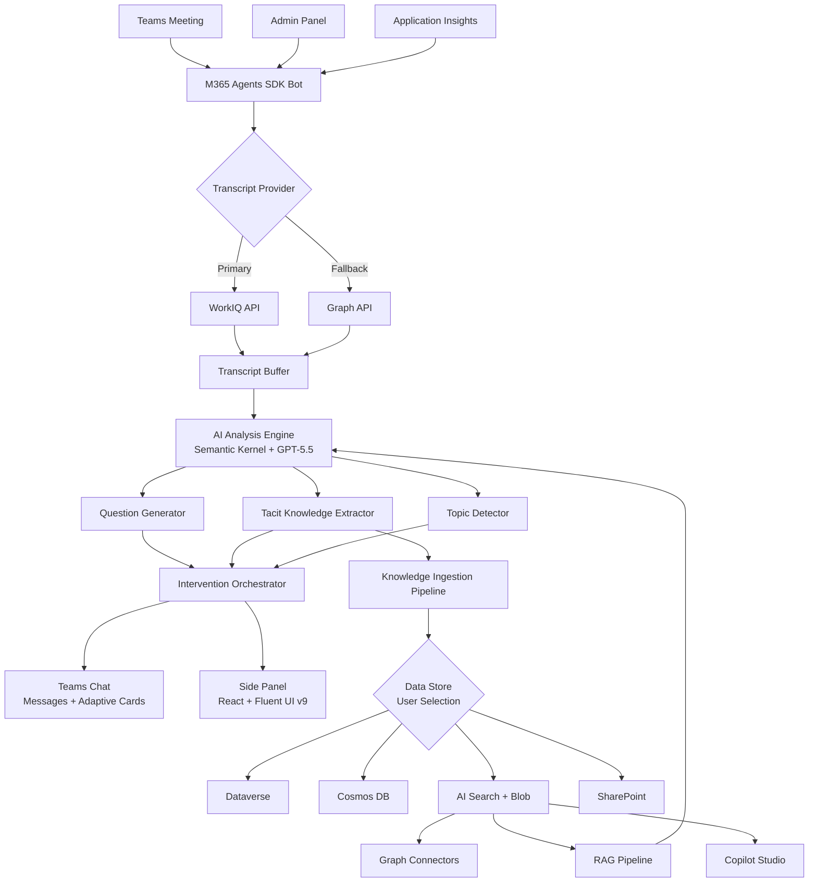

# AI Teammate — GitHub Copilot 開発指示文 インデックス

## プロジェクト概要

Teams会議にAIチームメイトとして参加し、リアルタイムで会話を分析。追加質問や議題提案を行い、暗黙知をナレッジベースに自動蓄積するエージェント。

## 確定要件サマリー

| 項目 | 決定事項 |
|------|---------|
| 開発言語 | C# (.NET 9+、プレビュー含む) |
| AIモデル | Azure OpenAI GPT-5.5（フォールバック: GPT-4.1） |
| エージェントSDK | Microsoft 365 Agents SDK |
| トランスクリプト | リアルタイムストリーミング（WorkIQ API優先、Graph APIフォールバック） |
| 介入方式 | 会議チャットメッセージ + Adaptive Card + サイドパネル |
| データストア | Dataverse / Cosmos DB / AI Search + Blob / SharePoint（ユーザー選択可能） |
| ナレッジ検索 | RAG（Azure AI Search ハイブリッド検索）+ Copilot Studio統合 |
| デプロイ先 | Azure Container Apps |
| テナント | マルチテナント |
| 認証 | Microsoft Entra ID (SSO) |
| AI Teammate動作 | 沈黙検知 / 議題切替 / @メンション / 常時監視・適宜介入 |
| 暗黙知カテゴリ | 意思決定背景 / 未文書化プロセス / 専門知識 / 議論経緯 / 他 |
| 質問タイプ | Why / Impact / Clarification / Alternative / Timeline / Risk / 他 |
| サイドパネルUI | React + Fluent UI v9 |
| 管理画面 | あり（設定変更・ナレッジ管理・統計ダッシュボード） |
| CI/CD | GitHub Actions |
| 監視 | Application Insights + Azure Monitor Workbooks + アラート |
| テスト | xUnit / 結合テスト / Playwright E2E / AI品質テスト |
| 多言語対応 | 自動検出（会議の言語に自動対応） |

## フェーズ一覧

| フェーズ | ファイル | 概要 |
|---------|---------|------|
| Phase 1 | [phase1-project-foundation.md](phase1-project-foundation.md) | プロジェクト基盤構築（ソリューション構成・IaC・CI・認証） |
| Phase 2 | [phase2-teams-bot-meeting.md](phase2-teams-bot-meeting.md) | Teams Bot + 会議参加機能（M365 Agents SDK・ライフサイクル・コマンド） |
| Phase 3 | [phase3-realtime-transcript.md](phase3-realtime-transcript.md) | リアルタイムトランスクリプト取得（WorkIQ/Graph API・バッファ・言語検出） |
| Phase 4 | [phase4-ai-analysis-engine.md](phase4-ai-analysis-engine.md) | AI分析・質問生成エンジン（Semantic Kernel・トピック検出・暗黙知抽出） |
| Phase 5 | [phase5-agent-intervention-ui.md](phase5-agent-intervention-ui.md) | エージェント介入・UI（Adaptive Card・サイドパネル・SignalR） |
| Phase 6 | [phase6-datastore-knowledgebase.md](phase6-datastore-knowledgebase.md) | データストア・ナレッジベース（4プロバイダー・埋め込み・パイプライン） |
| Phase 7 | [phase7-rag-copilot-integration.md](phase7-rag-copilot-integration.md) | RAG検索・Copilot Studio統合（ハイブリッド検索・品質管理） |
| Phase 8 | [phase8-admin-monitoring-production.md](phase8-admin-monitoring-production.md) | 管理画面・監視・テスト・本番化（管理UI・テレメトリ・CD・セキュリティ） |

## アーキテクチャ概要

## 使い方

各フェーズのマークダウンファイルを順番にGitHub Copilotに入力し、指示に従って実装を進めてください。各フェーズの末尾にある「完了条件」をチェックリストとして使用し、全条件を満たしてから次のフェーズに進んでください。
